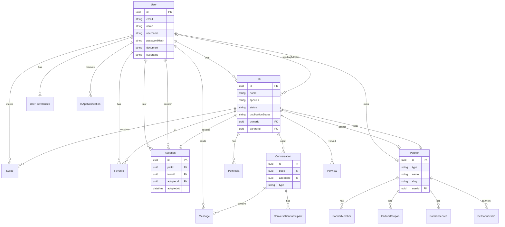
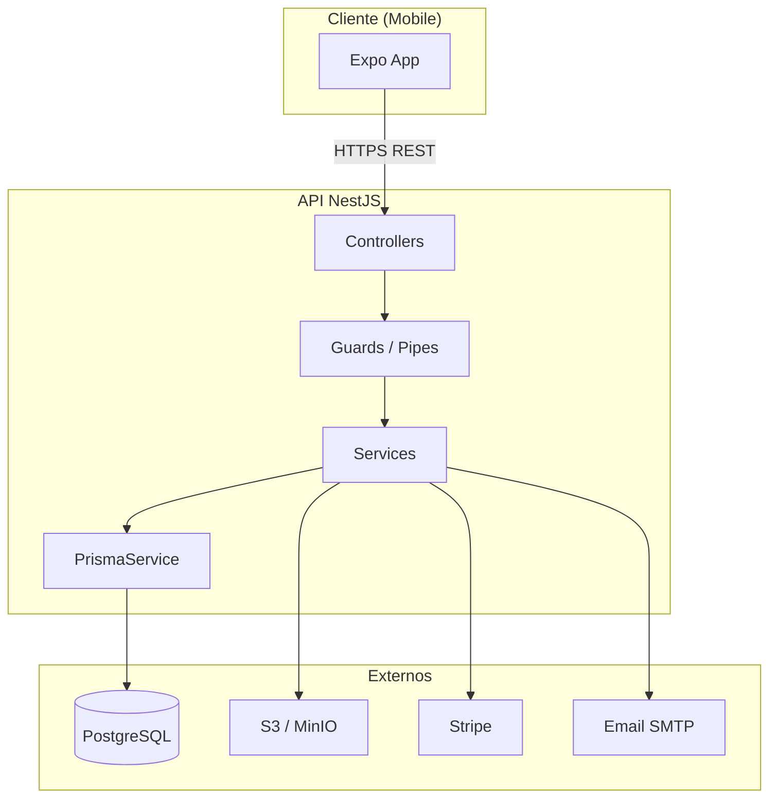
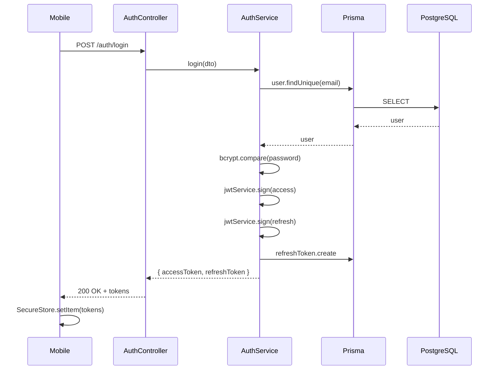
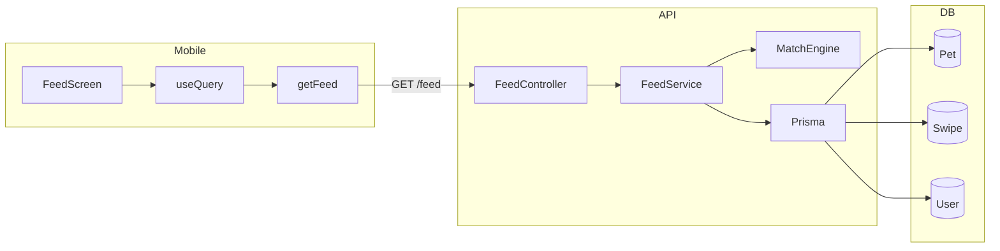
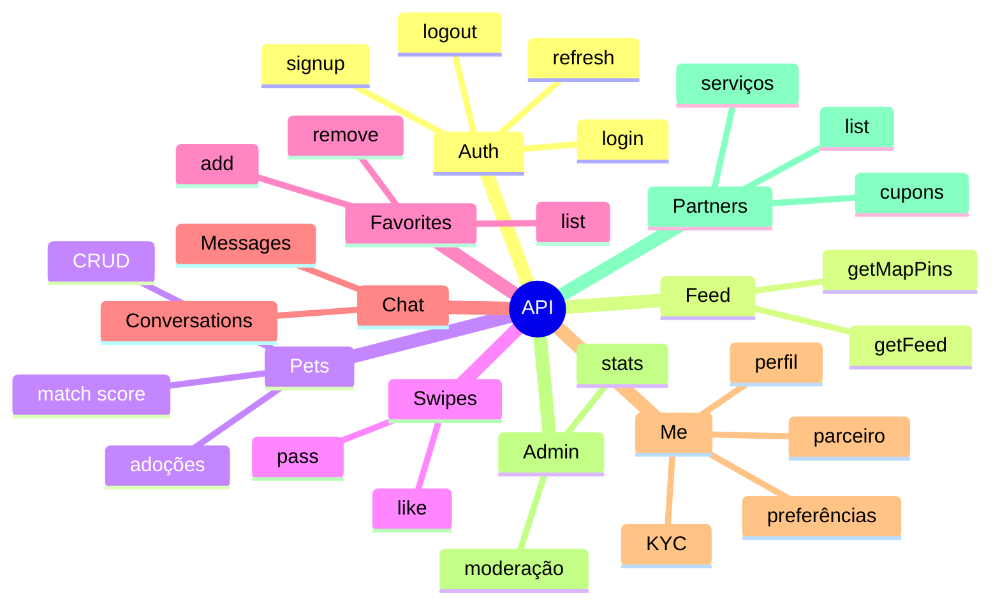

# Diagramas da arquitetura

Diagramas visuais do Adopet. Funcionam no GitHub e em ferramentas que suportam Mermaid.

---

## Visão geral do sistema

```
┌─────────────────────────────────────────────────────────────────────────┐
│                           USUÁRIO                                        │
│  (Celular iOS/Android)                                                   │
└─────────────────────────────────┬───────────────────────────────────────┘
                                  │
                                  ▼
┌─────────────────────────────────────────────────────────────────────────┐
│                    APP MOBILE (React Native + Expo)                      │
│  ┌─────────────┐  ┌─────────────┐  ┌─────────────┐  ┌─────────────┐    │
│  │   Zustand   │  │ React Query │  │ Expo Router │  │ API Client  │    │
│  │ (authStore) │  │   (cache)   │  │  (rotas)    │  │  (fetch)    │    │
│  └─────────────┘  └─────────────┘  └─────────────┘  └──────┬──────┘    │
└────────────────────────────────────────────────────────────┼────────────┘
                                                             │ HTTPS
                                                             ▼
┌─────────────────────────────────────────────────────────────────────────┐
│                    API (NestJS) — Vercel                                 │
│  ┌─────────────┐  ┌─────────────┐  ┌─────────────┐  ┌─────────────┐    │
│  │ Controllers │──│  Services   │──│   Prisma    │  │  S3/MinIO   │    │
│  │  (REST)     │  │  (lógica)   │  │   (ORM)     │  │  (fotos)    │    │
│  └─────────────┘  └─────────────┘  └──────┬──────┘  └─────────────┘    │
└───────────────────────────────────────────┼─────────────────────────────┘
                                            │
                                            ▼
┌─────────────────────────────────────────────────────────────────────────┐
│              PostgreSQL (Neon / Docker local)                            │
└─────────────────────────────────────────────────────────────────────────┘
```

---

## Diagrama do banco de dados (ER)



---

## Arquitetura da API (camadas)



---

## Fluxo de dados — Login



---

## Fluxo de dados — Feed



---

## Módulos da API



---

**Nota:** No GitHub, os blocos Mermaid são renderizados automaticamente. Em outros viewers Markdown, use um editor que suporte Mermaid (VS Code com extensão, Obsidian, etc.) ou um gerador de diagramas online.
